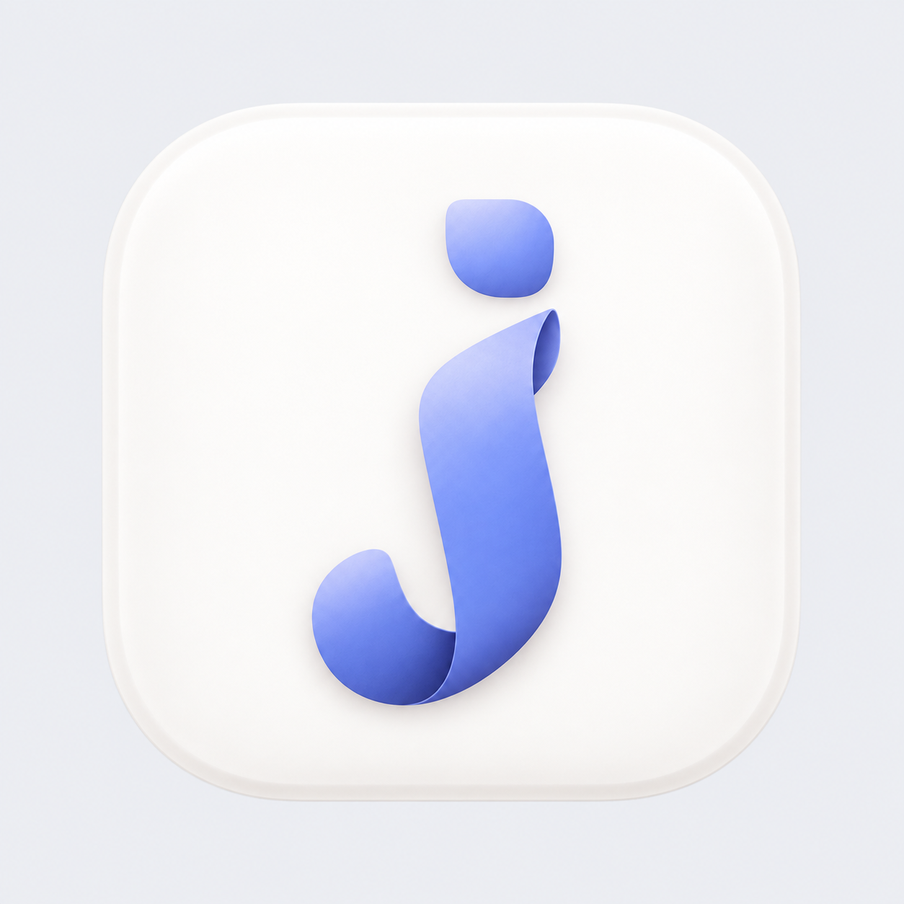

<p align="center">
  
</p>

# Jotwisp

**A quiet home for your text.**

A small, native macOS scratchpad for thoughts, copied answers, code snippets,
and plain-text tables. Start typing. Close the window. Come back to your drafts.
No filenames to choose, no account to create.

## Simple by design

- Automatically saved local drafts, with your workspace restored on reopening.
- Search titles and text across your draft library.
- A clean sidebar, line numbers, and a monospaced plain-text editor.
- Text that wraps with your window; optional unwrapped mode for wide tables.
- Quick clipboard capture into a new draft while Jotwisp is running.
- Native find/replace, text-file import/export, and recoverable Trash.
- System light/dark appearance and lightweight syntax highlighting.

Built with SwiftUI and AppKit. No browser runtime, third-party dependencies,
analytics, advertising, or cloud service. Text stays on your Mac.

## Get Jotwisp

**Mac App Store: in preparation, not yet available.** The planned price is
**US$9.99 once**, with regional pricing. No subscription or in-app purchases.
Buying the store edition will support development and provide store-managed
installation and updates.

**Build it yourself: free, under the [MIT license](LICENSE).** Requires macOS 14+
and Xcode with its command-line tools selected:

```sh
bash scripts/build.sh
open build/Jotwisp.app
```

This produces a local developer build, not a notarized public download. Build
before opening; do not rebuild over a running copy. To build separately, set
`JOTWISP_BUILD_APP=build/Preview/Jotwisp.app` when running the script.

## A few familiar shortcuts

| Action | Shortcut |
| --- | --- |
| New draft | ⌘N |
| Search all drafts | ⌘⇧F |
| Find in this draft | ⌘F |
| Toggle wrapping | ⌘⌥W |
| Import text files | ⌘O |
| Export current draft | ⌘⇧S |
| App Store quick capture | ⌃⌥V |
| Source-build quick capture | Hold ⌘ and C, then tap D |

The source chord needs Accessibility permission. The App Store shortcut does
not. Both editions offer **File → New Draft from Clipboard** without that
permission. Copy text first; images and empty clipboards do not create drafts.

## Honest limits

Jotwisp preserves plain-text spacing; it does not render rich-text tables,
images, or Markdown. Autosave is not cloud sync or version history: back up
your Mac. Undo history resets when switching drafts. Syntax highlighting is
lightweight and pauses above 1 MB.

The source and sandboxed App Store editions use separate local libraries.
Use export/import to transfer drafts; see [support](docs/SUPPORT.md).

## Help and development

[Support](docs/SUPPORT.md) · [Privacy](docs/PRIVACY.md) ·
[Contributing](CONTRIBUTING.md) · [Security](SECURITY.md) ·
[Development guide](docs/DEVELOPMENT.md) · [Release checklist](docs/RELEASING.md)

Contact: [rizy.izy15@gmail.com](mailto:rizy.izy15@gmail.com).
Use fictional text in public bug reports, never private drafts.

```sh
bash scripts/check-release.sh
bash scripts/test.sh
bash scripts/test.sh -Xswiftc -DAPP_STORE
bash scripts/build-appstore.sh --check
```

The last command compiles the universal sandboxed target without signing or
uploading it. A paid Apple Developer team and signing setup are required for
App Store distribution. See [verification status](VERIFICATION.md).
